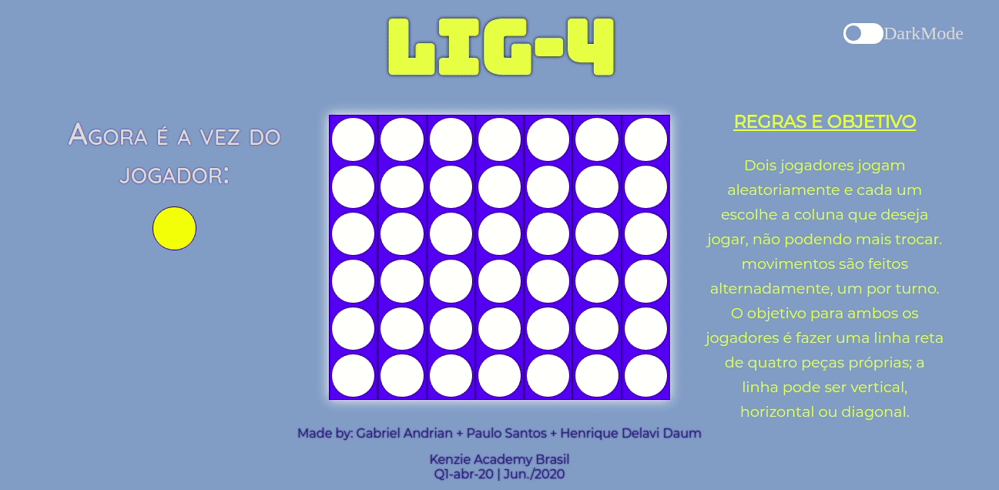

    <h1>LIG-4</h1>

 
    
    
    
        

    

 <a href="#💻-projeto">Projeto</a> •
 <a href="#🚀-vercel">Vercel App</a> •
 <a href="#🛠-tecnologias">Tecnologias</a> •  
 <a href="#👨🏽‍💻-autor">Autor</a>

# 💻 Projeto

Primeiro projeto realizado no curso da Kenzie Academy Brasil apenas com HTML, CSS e JavaScript.
O jogo tem como objetivo fazer uma linha reta de quatro peças próprias, tanto na vertical, horizontal ou diagonal.

Projeto realizado com os colegas de classe:

- Henrique Delavi Daum
- Paulo Santos

# 🚀 Vercel

- [Lig-4-vercel](https://lig-4-kappa.vercel.app/)

# 🛠 Tecnologias

Ferramentas usadas na construção do projeto:

- [VSCode](https://code.visualstudio.com/)
- [Git](https://git-scm.com)
- [JavaScript](https://developer.mozilla.org/pt-BR/docs/Web/JavaScript)
- [HTML](https://developer.mozilla.org/pt-BR/docs/Web/HTML)
- [CSS](https://developer.mozilla.org/pt-BR/docs/Web/CSS)
- [Vercel](https://vercel.com/)

# 👨🏽‍💻 Autor

## Sobre mim

Formado em Engenharia de Controle e Automação, com experiência em uma empresa focada em desenvolvimento de projetos e soluções para a área de automação industrial, onde tive maior contato com a programação, decidi então mudar de área e me tornar um programador.

Atualmente faço um curso super intensivo na Kenzie Academy Brasil de formação de 2000 horas onde estou aprendendo: HTML5, CSS3, JavaScript, Typscript, React, Node JS, Python, Flask, Django, Banco de Dados, entre outras hard skills e soft skills.
